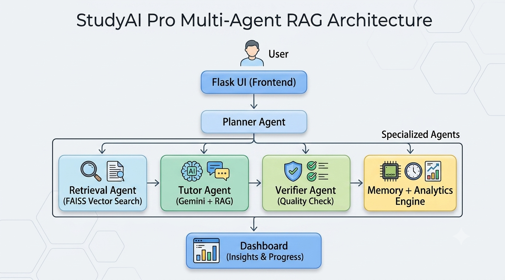
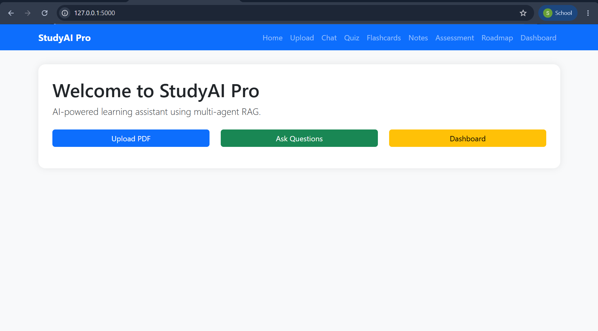
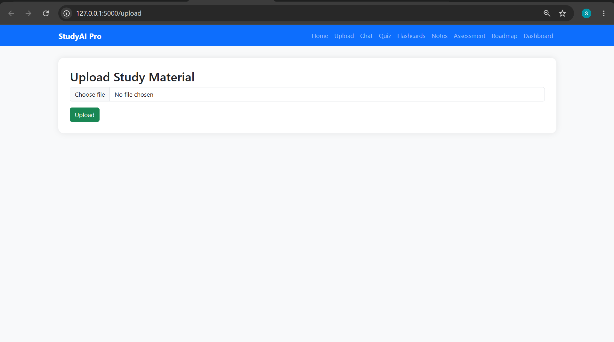
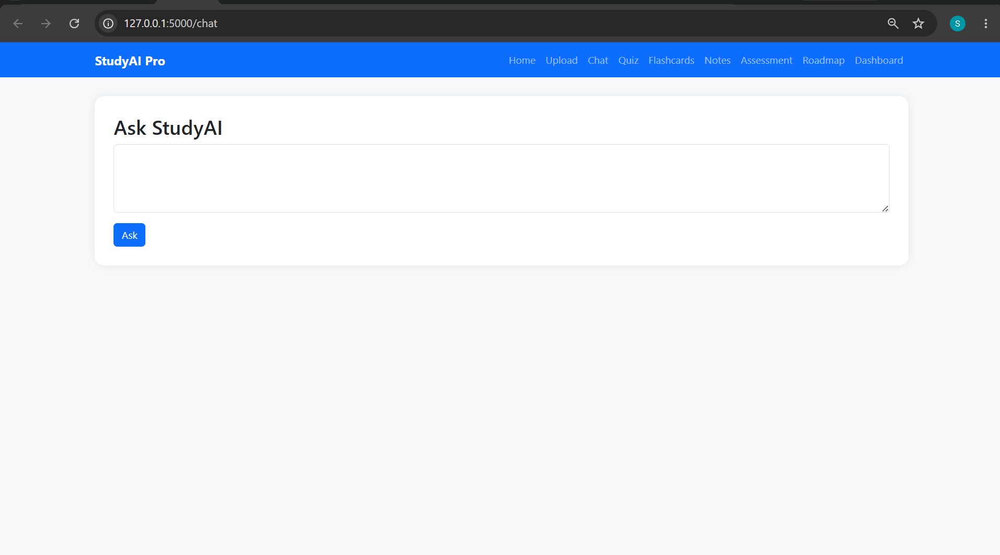
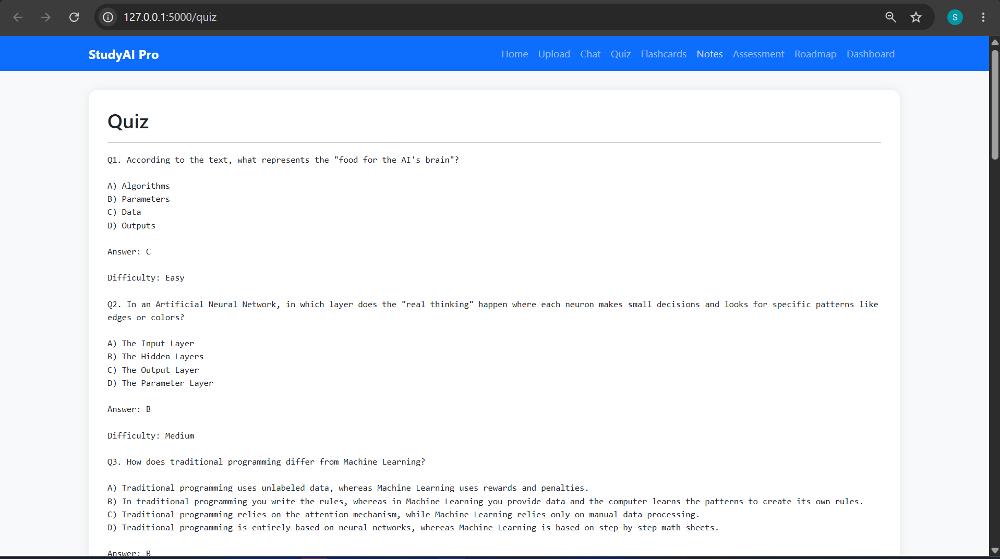
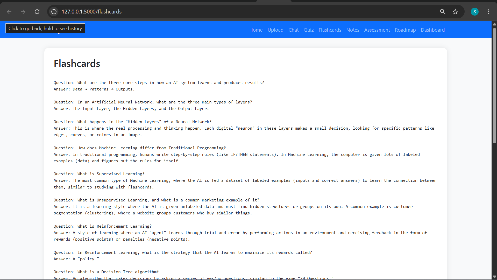
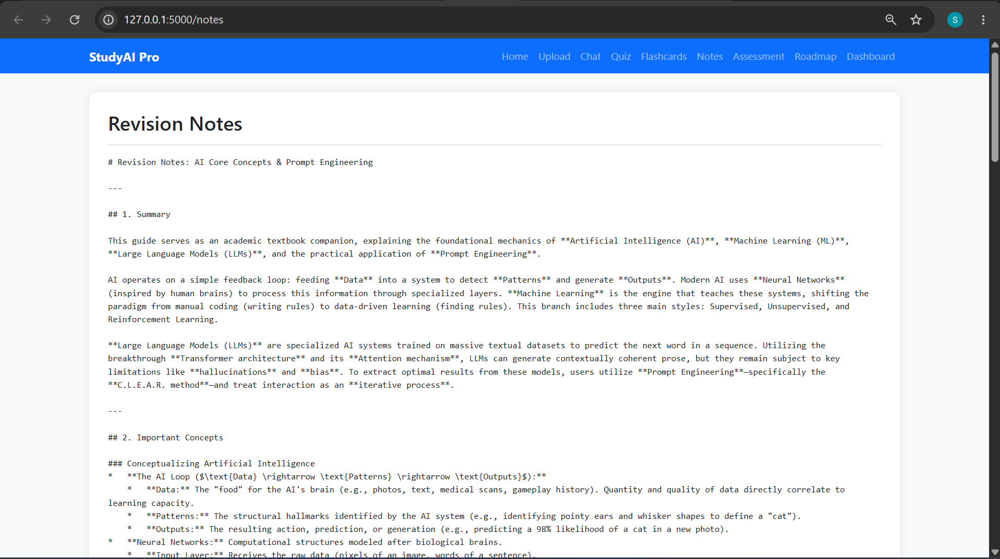
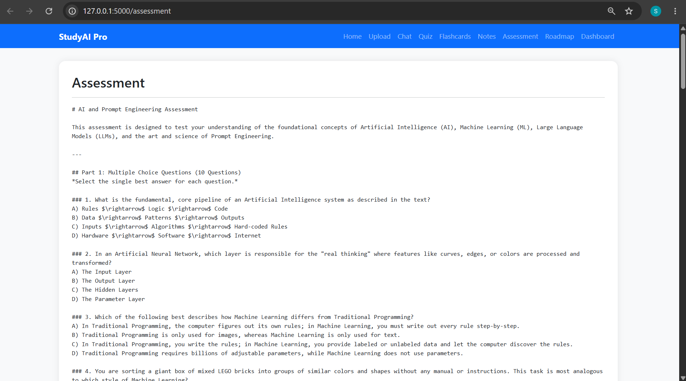
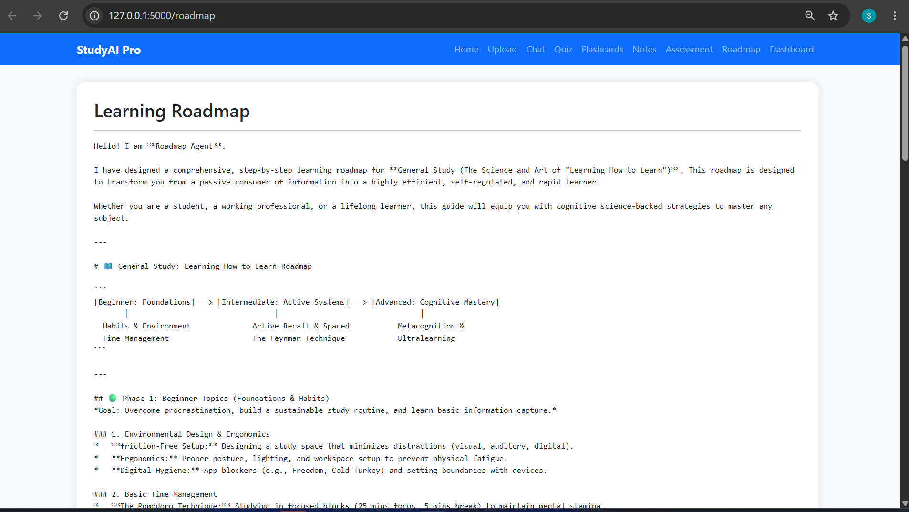
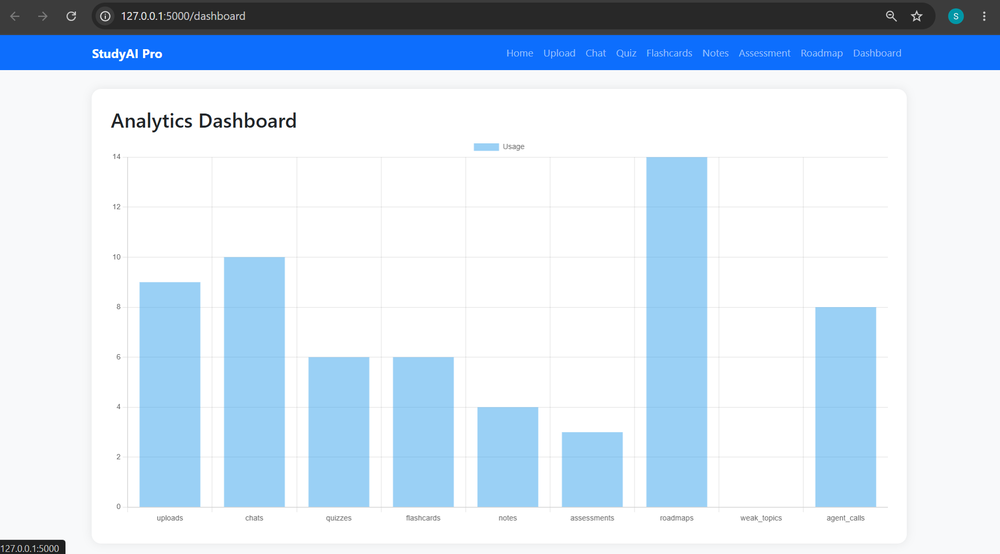

# 🎓 StudyAI Pro


---

> AI-powered Multi-Agent Learning Assistant that transforms PDFs into personalized learning experiences using Retrieval-Augmented Generation (RAG), Memory, Analytics, and Gemini AI.

Built for the **Microsoft Agents League Hackathon 2026**.

---

# 🎥 Demo Video

👉 [Watch Demo](https://youtu.be/Q2aurTVnR6c?si=7LGtVNL7REZODrF5)

---

# 🚀 Features

## 🤖 Multi-Agent Architecture

StudyAI Pro uses specialized AI agents:

* Planner Agent
* Retrieval Agent
* Tutor Agent
* Verifier Agent
* Quiz Agent
* Flashcard Agent
* Notes Agent
* Roadmap Agent
* Assessment Agent

---

## 📚 AI Tutor

* Chat with uploaded study materials
* Context-aware responses
* Retrieval-Augmented Generation (RAG)
* Reduced hallucinations through document grounding

---

## 📝 Revision Notes

Generate structured notes automatically from uploaded PDFs.

---

## 🎴 Flashcards

Create active-recall flashcards for faster revision and improved retention.

---

## ❓ Quiz Generator

Generate quizzes instantly from study materials.

* Multiple Choice Questions
* Concept Checks
* Revision Practice

---

## 📊 Assessment Generator

Evaluate understanding through AI-generated assessments.

---

## 🗺 Learning Roadmaps

Generate personalized study plans and learning paths.

---

## 🧠 Learning Memory

* Session tracking
* Learning history
* Personalized recommendations

---

## 📈 Analytics Dashboard

Visualize:

* Study activity
* Learning progress
* Assessment performance
* Session insights

---

# 🏗 Architecture



---

# 🛠 Tech Stack

| Category      | Technology            |
| ------------- | --------------------- |
| Backend       | Flask, Python         |
| AI Model      | Google Gemini         |
| Vector Search | FAISS                 |
| Embeddings    | Sentence Transformers |
| Database      | SQLite                |
| Frontend      | HTML, CSS, JavaScript |
| Analytics     | Chart.js              |
| Testing       | Pytest                |

---

# ⚡ Installation

## Clone Repository

```bash
git clone https://github.com/sathidevivaraprasadreddy/studyai-pro.git
cd studyai-pro
```

---

## Create Virtual Environment

```bash
python -m venv venv
```

### Windows

```bash
venv\Scripts\activate
```

---

## Install Dependencies

```bash
pip install -r requirements.txt
```

---

## Configure Environment Variables

Create a `.env` file:

```env
GEMINI_API_KEY=your_api_key
SECRET_KEY=studyai-secret
```

---

## Run Application

```bash
python app.py
```

Open:

```text
http://127.0.0.1:5000
```

---

# 📂 Project Structure

```text
studyai-pro/
│
├── agents/
│   ├── planner_agent.py
│   ├── retrieval_agent.py
│   ├── tutor_agent.py
│   ├── verifier_agent.py
│   ├── quiz_agent.py
│   ├── flashcard_agent.py
│   ├── notes_agent.py
│   ├── roadmap_agent.py
│   └── assessment_agent.py
│
├── memory/
├── orchestrator/
├── database/
├── vector_db/
├── templates/
├── static/
├── tests/
│
├── app.py
├── config.py
├── requirements.txt
└── README.md
```

---

# 📸 Screenshots

## Home



## Upload



## Chat



## Quiz Generator



## Flashcards



## Notes



## Assessment



## Roadmap



## Analytics Dashboard



---

# 🏆 Competition Submission

### Event

Microsoft Agents League 2026

### Category

Multi-Agent AI Systems

### Focus

AI-Powered Personalized Learning

### Highlights

* Multi-Agent Architecture
* Retrieval-Augmented Generation
* Personalized Learning Memory
* Analytics Dashboard
* Responsible AI Design

---

# 📚 Documentation

Located in `/docs`

* Architecture Document
* Responsible AI Statement
* Impact Statement
* Judging Criteria Alignment
* Demo Script

---

# 🔒 Responsible AI

StudyAI Pro follows responsible AI principles:

* Transparency
* Privacy Protection
* Human Oversight
* Fairness
* Secure File Handling

See:

```text
docs/responsible_ai.md
```

---

# 🌟 Future Enhancements

* Voice Tutor
* OCR Support
* Learning Gap Detection
* Mobile Application
* Multi-Language Learning
* Knowledge Graph Visualization

---

# 🧪 Testing

Run all tests:

```bash
python -m pytest -v
```

---

# 📄 License

MIT License

---

# 👨‍💻 Developer

**S. DEVI VARA PRASAD REDDY**

Building AI-powered educational systems that make learning smarter, faster, and more personalized.

---

# ⭐ Support

If you found this project useful, consider giving it a star ⭐ on GitHub.
